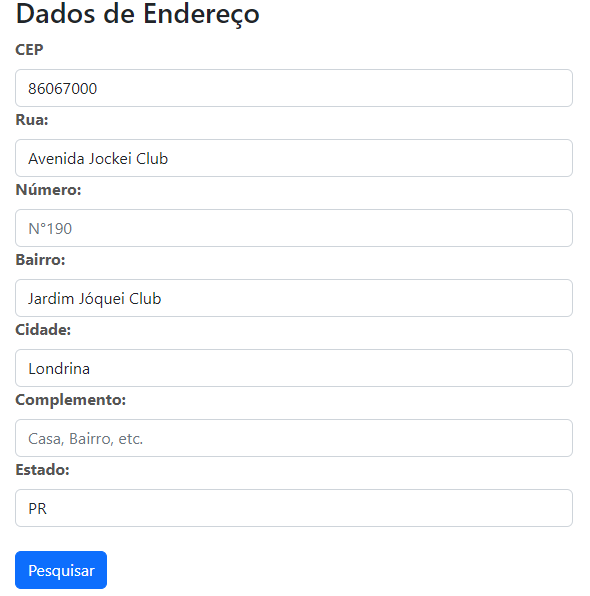
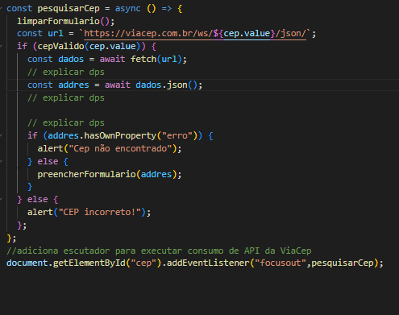

# cadastro de endereço

# biografia 
Esse código foi desenvolvido para facilitar o preenchimento de formulários de endereço, automatizando a busca de informações a partir de um simples CEP. Ele utiliza a API pública do [ViaCEP](https://viacep.com.br/), uma solução amplamente usada no Brasil para obter dados de localização com base no Código de Endereçamento Postal (CEP).
Este projeto é um exemplo de como consumir a API do ViaCEP para buscar informações de endereço com base no CEP informado pelo usuário e preencher um formulário automaticamente.




imagem do site de cadastro
_______________________________________________________________________________________________________________________________
1° parte do codigo
### limpeza dos campos de cadastro
 ```
 // função para limpar formulario
// -------------------------------------------------------------------------------------------------------------
    const limparforulario = () =>{
        document.getElementById('lagrodouro').value = '';
        document.getElementById('bairro').value = '';
        document.getElementById('localidade').value ='';
        document.getElementById('uf').value = "";
    }
  ```


  2° parte do codigo

  ### esta parte do codigo para verificar a quantidades de caracteres dentro do CEP
   ```// lenth e uma propiedade que verifica a quantidade de careacteres dentro do argumento cep
// -------------------------------------------------------------------------------------------------------------------------------------------
   const eNumero = (nuemero) => /^[0-9]+$/.teste(numero);
   const cepValido = (cep) => cep.length == 8& eNumero(cep);
   ```
  

  3° parte do codigo
  ## verificação de quantidades de caracteres 
   ``` 
   const eNumero = (numero) => /^[0-9]+$/.test(numero);
const cepValido = (cep) => cep.length == 8 && eNumero(cep);
/// length verifica a quantidade de caracteres do argumento cep
 
   ```

   4° parte do codigo
  ## função onde você deve prencher o campo cep e os outros campos se prenchenram automaticos  
     
   ```  // função para preencher formulario com campos da API
const preencherFormulario = (endereco) => {
  document.getElementById("logradouro").value = endereco.logradouro;
  document.getElementById("localidade").value = endereco.localidade;
  document.getElementById("bairro").value = endereco.bairro;
  document.getElementById("uf").value = endereco.uf;
}; 
```
5° parte do codigo
## ódigo que faz uma requisição para a API externa do ViaCep (um serviço público brasileiro que retorna informações sobre endereços com base em um CEP) e obtém os dados de resposta.

```
// função de consumo de API viaCep
 
// explicar dps
const pesquisarCep = async () => {
  limparFormulario();
  const url = `https://viacep.com.br/ws/${cep.value}/json/`;
  if (cepValido(cep.value)) {
    const dados = await fetch(url);
    // explicar dps
    const addres = await dados.json();
    // explicar dps
 
    // explicar dps
    if (addres.hasOwnProperty("erro")) {
      alert("Cep não encontrado");
    } else {
      preencherFormulario(addres);
    }
  } else {
    alert("CEP incorreto!");
  };
};
//adiciona escutador para executar consumo de API da ViaCep
document.getElementById("cep").addEventListener("focusout",pesquisarCep);
 ```

# Definição do codigo
Este projeto é uma implementação simples de consumo da API pública do ViaCep para consultar endereços com base em um CEP fornecido pelo usuário. O código permite que, ao digitar um CEP e sair do campo, seja feita uma busca automática e, se encontrado, o formulário de endereço seja preenchido com os dados retornados pela API.

# funcionalidades
* ### Validação de CEP: Verifica se o formato do CEP digitado é válido antes de fazer a requisição.
* ### Consumo da API ViaCep: Realiza uma consulta à API do ViaCep, enviando o CEP e recebendo os dados do endereço (logradouro, bairro, cidade, estado).
 * ## Preenchimento Automático: Caso o CEP seja encontrado, o formulário de endereço é preenchido automaticamente com as informações correspondentes.
 * ### Tratamento de Erro: Se o CEP não for encontrado na API, um alerta é exibido ao usuário.

 # como funciona 

 1. O usuário insere um CEP no campo de input e, ao sair do campo, a função pesquisarCep é executada.

2. O código valida o CEP usando a função cepValido. Se o CEP for válido, uma requisição fetch é enviada para a API ViaCep com o CEP fornecido.

3. A API retorna um objeto JSON contendo as informações do endereço ou um erro, caso o CEP não seja encontrado.

4. Se o CEP for encontrado, a função preencherFormulario preenche os campos do formulário com os dados retornados.

5. Caso o CEP não seja encontrado, um alerta informando "Cep não encontrado" é exibido.

## tecnologias usadas 
JavaScript: Para manipulação de eventos e requisições HTTP assíncronas (usando async/await e fetch).

HTML para o formulário.

JavaScript para o consumo da API ViaCEP.

Fetch API para fazer requisições HTTP assíncronas.

 1. ## async:
 * ### A função async no JavaScript é usada para definir uma função assíncrona, permitindo que o código execute operações que podem demorar (como chamadas a APIs ou operações de leitura de arquivos) sem bloquear a execução do restante do código.

2. ## await:
* ### A palavra-chave await no JavaScript é usada para esperar a resolução de uma Promise dentro de uma função assíncrona (async). Ela permite que o código seja executado de forma mais sequencial e legível, mesmo em operações assíncronas, como requisições de rede, leitura de arquivos, ou qualquer tarefa que leve tempo para ser concluída.
3. ## fethc:
 * ###  A função fetch() é usada em JavaScript para fazer requisições HTTP (como GET, POST, PUT, DELETE) a um servidor de forma assíncrona, geralmente para recuperar ou enviar dados de uma API. O fetch() retorna uma Promise, o que significa que você pode usar o encadeamento de métodos como then() e catch() para lidar com o resultado da requisição e possíveis erros.
 4. ### arrow funtion:
  ### Uma arrow function (função de seta) em JavaScript é uma maneira mais concisa de escrever funções introduzida no ECMAScript 6 (ES6). Elas são usadas principalmente para simplificar a sintaxe, tornando o código mais limpo e legível, especialmente em funções curtas.
  5. ## expreção regular:
   ### Uma expressão regular (ou regex) em JavaScript é uma sequência de caracteres que define um padrão de busca. Elas são usadas para realizar correspondências e manipulação de strings, como validação de entrada, busca e substituição de texto. O JavaScript fornece suporte nativo para expressões regulares através do objeto
   exemplo:
    
    /^[0-9]+$/
   6. ## getElementById:
   ### O método getElementById é uma função do DOM (Document Object Model) em JavaScript que permite selecionar e manipular elementos HTML em uma página da web. Este método é utilizado para obter uma referência a um único elemento do documento que possui um atributo id específico.
   7. ## addEventListener:
   ### O método addEventListener em JavaScript é usado para adicionar um "ouvinte de eventos" a um elemento do DOM. Esse ouvinte escuta um evento específico e executa uma função quando esse evento ocorre. O evento focusout é um dos muitos tipos de eventos que podem ser utilizados.
 8. ### focusout:
 ### O evento focusout é disparado quando um elemento perde o foco. Isso pode ocorrer, por exemplo, quando o usuário clica fora do elemento ou navega para outro campo, usando o teclado. É semelhante ao evento blur, mas com uma diferença importante: focusout é disparado em um elemento e em todos os seus elementos filhos, enquanto blur é disparado apenas no elemento que perdeu o foco.
 
_______________________________________________________________________________________________________________________________________________
  


  ### sites usados para desemvolver o site: 
   via cep:
   https://viacep.com.br/

   bootstrap:
   https://getbootstrap.com.br/docs/4.1/components/forms/


   desenvolvedor:
    


  ##  Este código é um exemplo de como uma pequena automação pode fazer uma grande diferença em termos de usabilidade e eficiência em sistemas online.