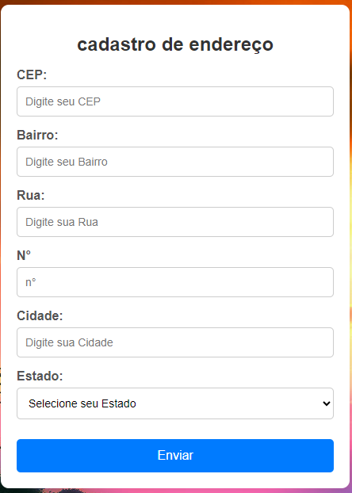

# cadastro de endereço

### site para cadastrar seu cep e saver o bairro, rua e cidade 
esse site foi desenvolvido nas aulas de web programação para cadastrae se cep sendo desembvolvido com javaScript sendo realizado em varias parte e sendo documentada bloco por bloco 




imagem do site de cadastro
_______________________________________________________________________________________________________________________________
1° parte do codigo
### limpeza dos campos de cadastro
 ```
 // função para limpar formulario
// -------------------------------------------------------------------------------------------------------------
    const limparforulario = () =>{
        document.getElementById('lagrodouro').value = '';
        document.getElementById('bairro').value = '';
        document.getElementById('localidade').value ='';
        document.getElementById('uf').value = "";
    }
  ```


  2° parte do codigo

  ### esta parte do codigo para verificar a quantidades de caracteres dentro do CEP
   ```// lenth e uma propiedade que verifica a quantidade de careacteres dentro do argumento cep
// -------------------------------------------------------------------------------------------------------------------------------------------
   const eNumero = (nuemero) => /^[0-9]+$/.teste(numero);
   const cepValido = (cep) => cep.length == 8& eNumero(cep);

    ```

   3° parte do codigo
 ##
    ```
   //    função para prencher fromularios com os campos da API

  const preencherFormulario = (endereco) =>{
      document.getElementById('logradouro').value = endereco.logradouro;
      document.getElementById('bairro').value = endereco.bairro;
      document.getElementById('localidade').value = endereco.localidade;
      document.getElementById('uf').value = endereco.uf;

}  ```